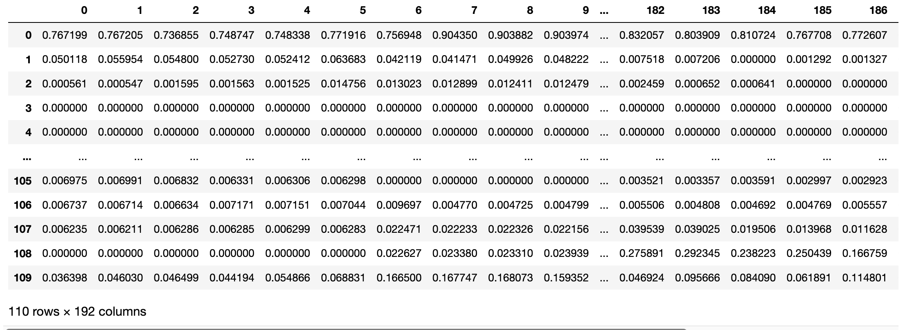

# Constrained Dictionary Learning of Rating Migration Matrices for Credit Risk Modeling
Implementation of the paper ["Constrained Dictionary Learning of Rating Migration Matrices for Credit Risk Modeling"](LINK),
by Michaël Allouche, [Emmanuel Gobet](http://www.cmap.polytechnique.fr/~gobet/), Clara Lage and Edwin Mangin.

## Abstract
Blablabla

## Dependencies
Clone the repo

```
git clone https://github.com/michael-allouche/dictionary-learning-RMM.git
cd dictionary-learning-RMM
```


Install the Python version and the requirements used in this repo

```
conda create --name dl_rmm python=3.10
conda activate dl_rmm
conda install --file requirements.txt
```

## Data
Load the full dataset
```
from utils.data_management import load_data
P = load_data()
pd.DataFrame(P)
```


Display the first migration matrix in matrix form
```
pd.DataFrame(P[:, 0].reshape(10,11,order='F'), columns=np.arange(1,12), index=np.arange(1,11))
```


## Training

## Dictionary

## Prediction

## Clustering

## Citation

