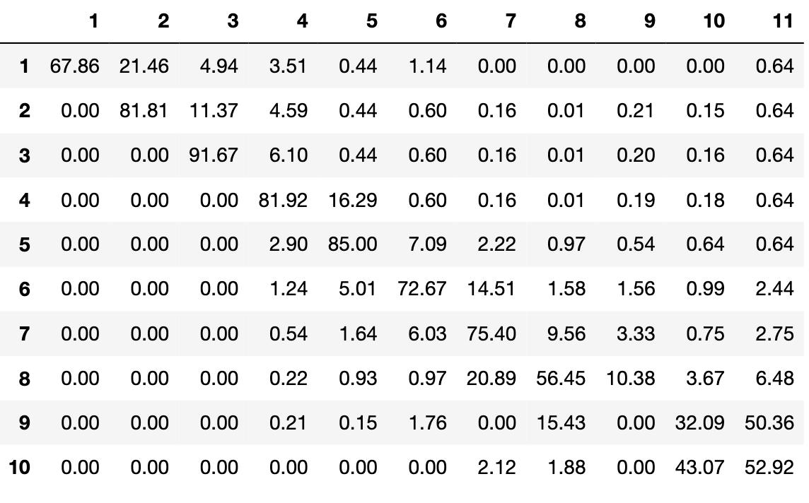

# Structured Dictionary Learning of Rating Migration Matrices for Credit Risk Modeling
Implementation of the paper ["Structured Dictionary Learning of Rating Migration Matrices for Credit Risk Modeling"](https://hal.archives-ouvertes.fr/hal-03715954),
by Michaël Allouche, [Emmanuel Gobet](http://www.cmap.polytechnique.fr/~gobet/), Clara Lage and Edwin Mangin.

## Abstract
Rating Migration Matrix is a crux to assess credit risks. 
Modeling and predicting these matrices are then an issue of great  importance for risk managers in any financial institution. 
As a challenger to usual parametric modeling approaches, we propose a new structured dictionary learning model with auto-regressive regularization that is able to meet key expectations and constraints: small amount of data,  fast evolution in time of these matrices, economic interpretability of the calibrated model. 
To show the model applicability, we present a numerical test with real data. 

## Dependencies
Clone the repo

```
git clone https://github.com/michael-allouche/dictionary-learning-RMM.git
cd dictionary-learning-RMM
```


Install the Python version and the library requirements used in this repo

```
conda create --name dlrmm-session python=3.10
conda activate dlrmm-session
conda install --file requirements.txt
```

## Data
Load the full dataset
```
from utils.data_management import load_data
import pandas as pd
P = load_data()
pd.DataFrame(P)
```


Display the first migration matrix in matrix form
```
pd.DataFrame(P[:, 0].reshape(10,11,order='F'), columns=np.arange(1,12), index=np.arange(1,11))
```


## Training
- Select the number of atoms (K) and the number of columns of the RMM (r_dim)
- The encoded constraints refer to the ones described in Section 1.5 in the [paper](https://hal.archives-ouvertes.fr/hal-03715954)
```
from models import DictionaryLearning
model = DictionaryLearning(K=3, r_dim=11)
model.fit(P, lamb=6, max_iter=500)
```
Each dictionary atom in a matrix form is a representative RMM of the risk configuration included in the dataset. 
### Atom 1 (stable risk)

### Atom 2 (upgrade risk)

### Atom 3 (downgrade risk)


## Clustering
Study the benefit of our proposed regularized DL model in order to obtain an interpretable classification of the RMM using a KMeans algorithm on the codings.

Each cluster can interpreted thanks to the weight proportion of the codings to each atom:


## Citation
@unpublished{allouche:hal-03715954,\
  TITLE = {{Structured Dictionary Learning of Rating Migration Matrices for Credit Risk Modeling}},\
  AUTHOR = {Allouche, Micha{\"e}l and Gobet, Emmanuel and Lage, Clara and Mangin, Edwin},\
  URL = {https://hal.archives-ouvertes.fr/hal-03715954}, \
  NOTE = {preprint},\
  YEAR = {2022} \
}

